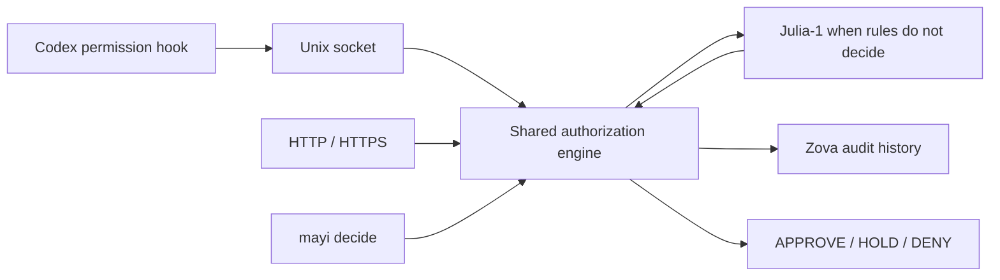

# MayI

MayI is a local-first authorization layer for coding agents.

It evaluates proposed operations and returns `approve`, `hold`, or `deny`.
Deterministic rules handle known cases; Julia-1 evaluates the rest. A daemon
shares one authorization engine across a Unix socket and optional HTTP/HTTPS,
with Zova keeping an audit trail. MayI evaluates operations but never executes
them.

Current package version: **0.1.0**. The default `0.98` approval threshold is an
initial conservative setting, not a calibrated safety guarantee.

## Contents

- [Install and try](#install-and-try)
- [How it works](#how-it-works)
- [CLI](#cli)
- [Configure Julia-1](#configure-julia-1)
- [Codex permission hook](#codex-permission-hook)
- [Requests and policy](#requests-and-policy)
- [HTTP and HTTPS](#http-and-https)
- [Container deployment](#container-deployment)
- [Audit history](#audit-history)
- [Development and evaluation](#development-and-evaluation)
- [Current boundaries](#current-boundaries)
- [Project structure](#project-structure)
- [License](#license)

## Install and try

Requires Python 3.14 and a Unix platform (macOS or Linux). Run these commands
from the source checkout with `uv` installed. Julia is optional for trying the
deterministic policy; its runtime and weights are installed separately below.

```sh
uv sync --locked
uv run mayi decide --command "git status"
uv run mayi decide --command "git push --force"
uv run mayi decide --command "git commit -m change"
```

Without Julia configured, these return `approve`, `deny`, and `hold`,
respectively. Commands are evaluated as text; MayI never executes them.
`decide` evaluates locally, opens the audit store, and loads a configured model
once for that invocation. Use the daemon for repeated low-latency requests.

Copy [config.example.toml](config.example.toml) to
`~/.config/mayi/config.toml`, or pass a path before the subcommand:

```sh
uv run mayi --config ./config.example.toml serve
```

In another terminal:

```sh
uv run mayi status
uv run mayi logs --decision hold --limit 20
```

The default socket is `~/.mayi/mayi.sock`, accessible only by its owner. Its
parent directory must be owned by the daemon user and not writable by others.
The daemon removes stale sockets, refuses to replace active sockets or regular
files, limits requests to 64 KiB, and closes idle connections after 15 seconds.

## How it works



The engine checks hard-deny rules first, then a narrow set of known-safe
operations. Remaining requests go to Julia. An approval needs Julia's
`approve` choice and a probability at or above the configured threshold.

| Outcome | Meaning |
| --- | --- |
| `approve` | The operation may proceed without a human prompt. |
| `hold` | Human review is needed, including on uncertainty or infrastructure failure. |
| `deny` | A deterministic hard-deny rule blocks the operation. |

Julia cannot override a hard deny. An audit-write failure prevents automatic
approval, while preserving an existing deny.

## CLI

| Command | Purpose |
| --- | --- |
| `mayi serve` | Start the daemon and load a configured Julia model once. |
| `mayi decide --command "git status"` | Evaluate a shell command locally and record the result. |
| `mayi decide --stdin` | Read a normalized JSON request from stdin. |
| `mayi status` | Query the running daemon over its Unix socket. |
| `mayi hook codex` | Translate a Codex permission request and query the daemon. |
| `mayi logs --decision hold --limit 20` | Inspect audit records. |

The installed executable is `.venv/bin/mayi`. Put `--config PATH` before the
subcommand. The default configuration path is `~/.config/mayi/config.toml`;
unknown sections and keys are rejected. See [config.example.toml](config.example.toml)
for supported deployment settings.

## Configure Julia-1

Use [SupersonicLabs/Julia-1](https://huggingface.co/SupersonicLabs/Julia-1),
whose Python distribution is `supersonic-julia` and import is `julia`.
It is unrelated to the Julia programming-language bridge on PyPI. MayI uses
only its public `load_model` and named-question `predict` APIs.

Following the upstream installation procedure, download the complete repository
(including roughly 550 MiB of weights), then install its package in MayI's
environment:

```sh
uv pip install --python .venv/bin/python huggingface_hub
.venv/bin/python -c "from huggingface_hub import snapshot_download; snapshot_download('SupersonicLabs/Julia-1', local_dir='Julia-1')"
uv pip install --python .venv/bin/python -e ./Julia-1
```

Set the absolute checkpoint directory in your configuration:

```toml
[julia]
model = "/absolute/path/to/Julia-1"
device = "cpu"
approval_threshold = 0.98
```

Julia owns its ML dependencies. MayI's lockfile covers MayI, Granian, and Zova;
the separately installed Julia runtime and checkpoint are managed separately.
After installing Julia, use `.venv/bin/mayi serve` (or `uv run --no-sync mayi
serve`) so an exact environment sync does not remove the separately installed
runtime. Keep checkpoint files unchanged while the daemon runs.

`serve` loads Julia once, with strict encoding, an 8,192-token limit and a
512-token question budget. Inference runs off the event loop and is serialized,
including after a requesting client times out. The default evaluation timeout
is 10 seconds; set `[server].request_timeout` for your hardware. Model load
failure, invalid output, overflow, inference errors, and timeouts produce HOLD
for requests that need Julia. Deterministic rules still apply.

## Codex permission hook

Start MayI first. In Codex's `~/.codex/hooks.json`, merge this entry into your
existing `hooks` object, replacing the executable path with your absolute path:

```json
{
  "hooks": {
    "PermissionRequest": [
      {
        "hooks": [
          {
            "type": "command",
            "command": "/absolute/path/to/mayi/.venv/bin/mayi hook codex",
            "timeout": 15
          }
        ]
      }
    ]
  }
}
```

For a custom config, the command is
`/absolute/path/to/mayi/.venv/bin/mayi --config /absolute/path/config.toml hook codex`.
Quote executable and configuration paths if they contain spaces. Keep the hook
timeout larger than MayI's request timeout plus transport overhead.

Review and trust the hook through Codex's `/hooks` interface. It runs only when
Codex would otherwise ask for permission:

| MayI result | Codex behavior |
| --- | --- |
| `approve` | Emits `hookSpecificOutput.decision.behavior: "allow"` |
| `deny` | Emits the corresponding `"deny"` decision |
| `hold` | Emits `{}`; Codex continues its native approval flow |

Malformed hook input, missing daemon, bad configuration, and transport failures
also emit `{}` with a successful hook exit. The hook does not load Julia or open
the audit database. See the [official Codex hooks documentation](https://learn.chatgpt.com/docs/hooks)
for hook trust, matching, and decision semantics. MayI does not install or trust
this hook automatically.

Example requests sent through `mayi hook codex` to a running daemon with Julia
unconfigured produced these results. The command strings were evaluated for
permission, not executed:

| Command | Decision | Source | Logged latency | Hook response |
| --- | --- | --- | --- | --- |
| `git status` | `approve` | `static_allow` | 6.84 ms | `allow` |
| `sudo -n true` | `deny` | `static_deny` | 1.48 ms | `deny` |
| `printf mayi-test` | `hold` | `fallback` | 1.85 ms | `{}` — native approval flow |

All three logged `confidence=None` because no model prediction was used.
Latencies are observations from this run, not performance guarantees. The
startup warning `julia_not_configured ambiguous_requests_will_hold` explains
the fallback: static rules still work, while requests needing Julia hold.

## Requests and policy

Send one JSON object per line over the Unix socket. `input` and `metadata`
default to empty objects; `operation`, `cwd`, and `reason` are optional:

```json
{"agent":"codex","tool":"shell","operation":"cargo test","cwd":"/work/project","input":{"command":"cargo test"}}
```

Response:

```json
{"decision":"approve","source":"static_allow","confidence":null,"reason":"Known development command"}
```

The order is hard deny → narrow known-safe rules → Julia → confidence threshold.
Julia cannot override a hard deny and only selects `approve` or `hold`.
The centralized question lives in `src/mayi/julia/prompt.py`.

Hard-deny patterns cover root deletion, sudo, force pushes, remote scripts piped
to a shell, SSH paths, and `/etc` paths. For simplicity, v0 denies `/etc` reads
too. These are explicit patterns, not a complete shell parser: obfuscated
commands, shell variables, aliases, and filesystem symlinks are not fully
resolved. More complex operations go to Julia rather than being prefix-allowed.

The small static allow list covers plain `cargo test`, `cargo check`, `pytest`,
`ruff check`, `git status`, `git diff`, and `git log`, with a few explicit flags.
It assumes a trusted development checkout and normal executables: build and
test commands can run repository code. MayI is an approval aid, not an OS
sandbox or a tamper-proof boundary against processes running as the same user.

The Python core can also be used without a daemon:

```python
import asyncio
import mayi

request = mayi.AuthorizationRequest("manual", "shell", "git status")
result = asyncio.run(mayi.authorize(request))
print(result.decision)
```

This convenience API uses deterministic policy and otherwise returns HOLD.
`mayi.Evaluator(model, threshold=0.98, audit=store)` adds a resident
`mayi.julia.engine.JuliaEngine` and audit store. Transport handlers share that
same evaluator. Library callers choose their own lifecycle; the CLI configures
both model and storage.

## HTTP and HTTPS

```toml
[http]
enabled = true
host = "127.0.0.1"
port = 7411
# ssl_cert = "/path/to/cert.pem"
# ssl_key = "/path/to/key.pem"
```

Granian serves `POST /v1/decide`, `GET /v1/health`, and `GET /v1/status`.
The decision endpoint accepts the same request object and returns the same
result as the Unix socket. Health indicates process availability; status also
reports `julia_available` and `approval_threshold`.

```sh
curl http://127.0.0.1:7411/v1/decide \
  -H 'Content-Type: application/json' \
  -d '{"agent":"manual","tool":"shell","operation":"git status"}'
```

Non-loopback binds require a bearer token. Set `MAYI_BEARER_TOKEN` before
starting the daemon and send `Authorization: Bearer <token>`. When configured,
authentication applies to all three endpoints, including on loopback. Use TLS
certificates or an HTTPS reverse proxy when crossing a network. Both certificate
and private-key paths must be supplied together. The service intentionally uses
Granian's single-process embedded server so both transports share one model;
upstream currently labels that interface experimental.

## Container deployment

Build with the repository's `.dockerfile`, then supply a bearer token and a
named volume for persistent audit data:

```sh
docker build -f .dockerfile -t localhost/mayi:local .
export MAYI_BEARER_TOKEN="$(openssl rand -hex 32)"
docker run --rm --name mayi \
  -p 127.0.0.1:7411:7411 \
  -e MAYI_BEARER_TOKEN \
  -v mayi-data:/data \
  localhost/mayi:local
```

Podman supports the same commands: replace `docker` with `podman`. The image
and its authentication, decision, hook, and persistence paths have been smoke
tested with Podman on Linux/amd64. With a remote Podman connection, the published
port belongs to the remote host.

The image runs as UID 10001 and uses [config.docker.toml](config.docker.toml).
It listens on port 7411 inside the container; the example publishes that port
only on the host's loopback interface. All HTTP endpoints require the token:

```sh
curl http://127.0.0.1:7411/v1/status \
  -H "Authorization: Bearer $MAYI_BEARER_TOKEN"
docker exec mayi mayi --config /app/config.toml status
```

To override configuration, add
`-v "$PWD/my-config.toml:/app/config.toml:ro"` to `docker run`. Keep the socket
and audit paths under `/data`; host bind mounts at `/data` must be writable by
UID 10001 and must not be writable by other users.

As with the default local installation, Julia's runtime and checkpoint are not
bundled. Deterministic policy works immediately; other requests return HOLD.
For Julia inference, install its package in `/app/.venv` in a derived image,
mount the checkpoint read-only, and set `[julia].model` to its container path.

## Audit history

Zova stores decisions in `~/.local/share/mayi/mayi.zova` with owner-only file
permissions. Records include a generated request ID, UTC timestamp, agent/tool,
operation, working directory, decision/source, Julia probabilities, metadata,
and a null `human_decision`. Audit-write failure prevents automatic approval;
an already reached hard deny remains a deny.

Operations and metadata can contain secrets. Raw tool input and the supplied
reason are retained only with `[storage].retain_input = true`. Normal logs omit
request bodies. Human outcomes from Codex's native prompt are not captured yet;
history never changes future authorization policy automatically.

## Development and evaluation

```sh
.venv/bin/python -m unittest discover -s tests -v
.venv/bin/python -m mayi.evaluation --fixtures tests/fixtures/permissions.json
```

Tests use standard-library `unittest`, mocked Julia boundaries, real temporary
Zova files, Unix sockets, and a local Granian server. No checkpoint is downloaded
by normal tests. Run the opt-in real-model test after installing Julia:

```sh
MAYI_TEST_MODEL=/absolute/path/to/Julia-1 \
  .venv/bin/python -m unittest discover -s tests -p test_julia.py -v
```

The fixture runner evaluates command text through the complete configured
evaluator and records its decisions; it never executes those commands. It
reports approval, HOLD, hard-deny, and false-automatic-approval rates plus median
and p95 latency. Rates use all fixture requests as their denominator. The labels
are conservative development examples, not collected human outcomes. Real
threshold calibration still requires representative usage and human labels.

Build the wheel and source distribution with:

```sh
uv build
```

Build artifacts go to `dist/`. See [AGENTS.md](AGENTS.md) for the development
workflow and the invariants that changes must preserve.

## Current boundaries

MayI is an approval aid for trusted coding environments, not an OS sandbox.
Its shell patterns are intentionally small and do not fully resolve aliases,
variables, obfuscation, or filesystem symlinks. Model confidence alone does not
establish that an operation is safe.

The default installation and container omit Julia's runtime and checkpoint.
Their absence leaves deterministic policy available and returns HOLD for the
remaining requests. Check `julia_available` in status before expecting model
inference. Checkpoint-backed inference and the native Codex approval UI have not
yet been verified in a real coding session.

Human outcomes from native approval prompts are not captured automatically.
History is for auditing and evaluation; MayI does not learn authorization policy
from previous decisions. Threshold calibration requires representative usage
and human labels.

## Project structure

| Path | Responsibility |
| --- | --- |
| `src/mayi/core/` | Normalized requests/results, deterministic policy, evaluator. |
| `src/mayi/julia/` | Julia runtime wrapper and centralized authorization question. |
| `src/mayi/server/` | Shared protocol, Unix server/client, raw ASGI application. |
| `src/mayi/adapters/` | Codex permission-hook translation. |
| `src/mayi/storage/` | Zova audit persistence and queries. |
| `src/mayi/cli.py`, `config.py` | CLI lifecycle and TOML configuration. |
| `src/mayi/evaluation.py` | Permission-fixture metrics. |
| `tests/` | Unit/integration tests and permission fixtures. |
| `.dockerfile`, `config.docker.toml` | Container build and runtime defaults. |

Contributor and agent instructions are in [AGENTS.md](AGENTS.md).

## License

This repository does not currently include a license file.
