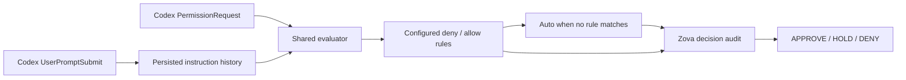

# MayI

MayI evaluates coding-agent operations and returns **approve**, **hold**, or
**deny** before they run.

Use it to automate some approval prompts while keeping human review for
uncertain requests. Optional rules handle explicit cases; Auto-200M INT8 checks
the rest against captured user instructions. A resident daemon serves the Codex
hook and records decisions in Zova. MayI never executes the proposed operation.

Version **0.1.0** — experimental. The current model can incorrectly approve
requests, including vague “go ahead” instructions after an earlier restriction.
The default 98% threshold is not a calibrated safety guarantee.

## Contents

- [Install](#install)
- [Quick start](#quick-start)
- [How decisions work](#how-decisions-work)
- [Connect Codex](#connect-codex)
- [Configure rules](#configure-rules)
- [Container deployment](#container-deployment)
- [Local Auto runtime](#local-auto-runtime)
- [CLI and API](#cli-and-api)
- [Audit and telemetry](#audit-and-telemetry)
- [Current boundaries](#current-boundaries)
- [Validation and development](#validation-and-development)
- [Further reading](#further-reading)
- [License](#license)

## Install

Install from the source checkout using Python 3.14 and `uv`:

```sh
git clone https://github.com/ata-sesli/MayI.git
cd MayI
uv sync --locked
.venv/bin/mayi --help
```

This installs the CLI, Granian and Zova. The model runtime is separate.
Use the [container](#container-deployment) to install Auto's runtime and download
its checkpoint automatically, or follow [local runtime setup](#local-auto-runtime).

| Component | Requirements |
| --- | --- |
| CLI and daemon | Python 3.14; macOS or Linux; `uv` for the setup above. |
| Container | Podman or Docker; built and tested on Linux/amd64. |
| Auto inference | CPU Torch and Transformers, plus the pinned INT8 checkpoint. |
| Codex adapter | Codex with hooks enabled; a running MayI daemon. |
| Remote access | Verified HTTPS and a bearer token. Tailscale is optional. |

## Quick start

Try a local decision without downloading a model:

```sh
.venv/bin/mayi --config config.example.toml decide --command "git status"
```

This returns HOLD: the example config has no model enabled, and the shipped
[policy.toml](policy.toml) has no rules. The command is evaluated as text and
is not executed.

Start the daemon:

```sh
.venv/bin/mayi --config config.example.toml serve
```

In another terminal:

```sh
.venv/bin/mayi --config config.example.toml status
.venv/bin/mayi --config config.example.toml logs --decision hold --limit 20
```

For a persistent personal configuration, copy `config.example.toml` and
`policy.toml` into `~/.config/mayi/`. MayI uses
`~/.config/mayi/config.toml` by default. Keep personal settings in ignored files;
put `--config PATH` before the subcommand when using another configuration.

The default socket is `~/.mayi/mayi.sock`; audit storage is
`~/.local/share/mayi/mayi.zova`. Only the daemon user can access the socket.

## How decisions work



For Codex requests, MayI first resolves instructions matching the session,
current turn and working directory. Missing, stale, oversized or ambiguously
ordered context returns HOLD before rules or model evaluation.

It then checks deny rules, exact-command allow rules, and finally Auto. Auto
receives the original ordered instructions separately from the agent-written
reason. An automatic approval requires P(approve) ≥ 0.98. Native model denials
and ties become HOLD; only a configured deny rule can produce DENY.

| Result | Codex behavior |
| --- | --- |
| APPROVE | The permission hook emits `allow`. |
| HOLD | The hook emits `{}` and Codex continues its normal approval flow. |
| DENY | The permission hook emits `deny`. |

Auto cannot override a matched rule. Invalid model output and inference errors
HOLD. An audit-write failure prevents approval while preserving an existing
hard deny. All transports use the same evaluator.

The daemon loads the model once and serializes inference. The hook is a short
client process: it connects to an existing daemon and never starts one.

## Connect Codex

Install the CLI on the machine running Codex and start MayI locally or remotely.
Merge these entries into `~/.codex/hooks.json`, replacing the executable paths:

```json
{
  "hooks": {
    "UserPromptSubmit": [{"hooks": [{
      "type": "command",
      "command": "/absolute/path/to/mayi/.venv/bin/mayi hook codex --user-prompt",
      "timeout": 15
    }]}],
    "PermissionRequest": [{"hooks": [{
      "type": "command",
      "command": "/absolute/path/to/mayi/.venv/bin/mayi hook codex",
      "timeout": 15
    }]}]
  }
}
```

Use the same configuration for both hooks. For a custom path, include
`--config /absolute/path/to/hook.toml` before `hook codex` in both commands.
Quote paths containing spaces. Review and trust the definitions in Codex's
`/hooks` interface. See the [Codex hook documentation](https://learn.chatgpt.com/docs/hooks)
for the event contract.

`UserPromptSubmit` sends original text directly to the daemon for persistence.
MayI uses those captures without signatures or separate human confirmation;
generated continuations may also be treated as instructions. Earlier
instructions and later corrections remain separate ordered entries.
`transcript_path` is never read, and prompts are not cached in an agent-writable
context file.

Capture failure blocks prompt submission. Permission-request errors fall
through to Codex's normal prompt. `PermissionRequest` runs only when Codex
would otherwise ask for approval, not for every tool call.

For a remote-only daemon, the Codex machine needs just the installed hook
client and an endpoint configuration. It does not need Auto or a local daemon.

### Multiple endpoints

Configure endpoints in their initial order:

```toml
[hook]
timeout = 25.0
connect_timeout = 2.0

[[hook.endpoints]]
url = "https://server-a.YOUR-TAILNET.ts.net/v1/decide"
token_file = "~/.config/mayi/server-a.token"
timeout = 12.0

[[hook.endpoints]]
url = "https://server-b.YOUR-TAILNET.ts.net/v1/decide"
token_file = "~/.config/mayi/server-b.token"
timeout = 12.0
```

For these deadlines, set both Codex hook timeouts to 30 seconds. Token files
must be owned by your user and have no group/other permissions, such as mode
600. Keep them outside the repository.

The hook tries the last endpoint that returned a valid decision first. Only
unavailability advances to the next server. Any valid decision, including HOLD,
stops fallback; authentication, TLS and malformed-response failures also stop
it. HTTP 404 is treated as unavailable. No request polls every server.

Prompt histories are not replicated between daemons. A fallback server missing
the session's context returns HOLD. See [network deployment](docs/network-deployment.md)
for Unix/HTTP combinations, routing state, timeouts, Portless and Tailscale.

## Configure rules

Rules live in a TOML file. There are no built-in command allow or deny lists:

```toml
allow = []
deny = []
```

Select the file and policy in the daemon config:

```toml
[policy]
mode = "approve-or-hold"
file = "policy.toml"
```

Relative paths resolve beside that config. Missing or invalid configured files
stop startup. Restart the daemon after changing rules.

To add explicit rules, replace the empty lists with, for example:

```toml
[[allow]]
id = "git-status"
tool = "shell"
command = "git status"

[[deny]]
id = "privilege"
pattern = '\bsudo\b'
```

Codex's Bash tool is normalized to `shell`. Allow rules match the exact
normalized tool and command; shell operators, redirection, conflicting command
fields and additional tool settings prevent static approval. Deny patterns are
Python regular expressions applied to the operation, directory and string tool
inputs, including normalized shell words and paths. Rule IDs must be unique.

| Policy | Allow match | Deny match | Unmatched request |
| --- | --- | --- | --- |
| `strict` — local default | APPROVE | DENY | Auto, or HOLD if unavailable. |
| `approve-or-hold` — container default | APPROVE | HOLD | Auto, or HOLD if unavailable. |

A deny match ends evaluation immediately in both modes. Responses and audit
records retain the selected policy and matched rule. Policy belongs to the
daemon; a request cannot change it.

## Container deployment

From the checkout:

```sh
podman build -f .dockerfile -t localhost/mayi:local .
export MAYI_BEARER_TOKEN="$(openssl rand -hex 32)"
podman run --rm --name mayi \
  -p 127.0.0.1:7411:7411 \
  -e MAYI_BEARER_TOKEN \
  -v mayi-data:/data \
  localhost/mayi:local
```

Docker uses the same commands with `docker` in place of `podman`.
The image installs CPU Torch/Transformers and downloads the pinned Auto
checkpoint on first startup. It opens listeners only after loading succeeds;
initial startup needs Hugging Face access and may take several minutes.

The process runs as UID 10001 with [config.docker.toml](config.docker.toml), an
empty policy file and approve-or-hold mode. The named volume holds the socket,
audit database, prompts and model cache. Retain it across container replacement.
Reuse the same token when reconnecting existing clients. This foreground
example does not configure automatic startup after a host reboot.

Check readiness from another terminal:

```sh
curl http://127.0.0.1:7411/v1/status \
  -H "Authorization: Bearer $MAYI_BEARER_TOKEN"
podman exec mayi mayi --config /app/config.toml status
```

Look for `model_available: true`. Authentication applies to all HTTP endpoints.
The published port belongs to the container host, including with remote Podman.

Mount custom config at `/app/config.toml:ro` and rules at `/app/policy.toml:ro`.
Keep storage and socket paths under `/data`; custom `/data` mounts must grant
UID 10001 access and must not be writable by others. Config and policy files
must be readable by that UID. On SELinux hosts, use `:ro,Z` for their bind mounts.
Keep tokens in the environment or private files, never in the image.

Publish only to loopback unless an HTTPS reverse proxy or native TLS protects
network access. [Network deployment](docs/network-deployment.md) covers private
Tailscale endpoints and Portless.

## Local Auto runtime

The tested Linux CPU setup uses the same versions as the container:

```sh
uv pip install --python .venv/bin/python --index-url https://download.pytorch.org/whl/cpu 'torch==2.14.0'
uv pip install --python .venv/bin/python 'transformers==5.17.0'
```

Enable this model section in your daemon config:

```toml
[model]
model = "hf://ProCreations/auto-200m-2-int8@2501a22901e8cc520c746a86f3f9d04f7feaaefb"
device = "cpu"
approval_threshold = 0.98
```

A local snapshot directory is also accepted. MayI verifies the executable
loader's pinned SHA-256 before importing it. Model files are cached in `models/`
beside the audit database. Auto is the only supported model implementation.

The ML packages are outside MayI's lockfile. After installing them, use
`.venv/bin/mayi` or `uv run --no-sync`; an exact sync can remove those packages.
A command-only `decide` invocation does not supply captured instructions, so
Auto will HOLD it. Use the paired Codex hooks for context-aware decisions.

## CLI and API

| Command | Purpose |
| --- | --- |
| `mayi serve` | Start the daemon and load its configured model once. |
| `mayi status` | Query the daemon over its Unix socket. |
| `mayi decide --command "git status"` | Evaluate locally and record a decision. |
| `mayi decide --stdin` | Evaluate a normalized JSON request from stdin. |
| `mayi hook codex --user-prompt` | Persist a submitted prompt; block on failure. |
| `mayi hook codex` | Handle permission requests or supported outcome events. |
| `mayi logs --decision hold --limit 20` | Read decision audits. |
| `mayi logs --events --limit 50` | Read telemetry events. |
| `mayi feedback --request-id REQUEST_UUID --decision approve` | Record explicit human feedback; use `deny` for rejection. |

`decide` opens its own audit store and loads a configured model for that
invocation. It does not send the decision request to the running daemon.
`logs` reads the configured store locally; on a container host, use
`podman exec mayi mayi --config /app/config.toml logs --limit 20`.

The Unix protocol uses one JSON object per line. Optional HTTP exposes
`POST /v1/decide`, `POST /v1/events`, `GET /v1/health` and `GET /v1/status`.
Enable `[http].enabled` in a local config; non-loopback binds require a bearer
token. `MAYI_BEARER_TOKEN` overrides the configured token. Native HTTPS requires
both `ssl_cert` and `ssl_key`.

A minimal normalized request looks like this:

```json
{"agent":"manual","tool":"shell","operation":"git status","input":{"command":"git status"}}
```

With no configured rules or context, it returns HOLD. Codex requests additionally
need `metadata.session_id`, `metadata.turn_id` and `cwd` matching persisted
captures. Caller-supplied `user_context` is rejected.

The Python convenience API requires no daemon:

```python
import asyncio
import mayi

request = mayi.AuthorizationRequest("manual", "shell", "git status")
result = asyncio.run(mayi.authorize(request))
print(result.decision)
```

This convenience call has neither rules nor a model and returns HOLD. A
configured `mayi.Evaluator` owns policy, model and audit integration; embedding
callers own resource lifetimes. The CLI creates and closes those resources.

## Audit and telemetry

Zova stores request IDs, decisions, probabilities, matched rules, context
references and evaluation metadata. Submitted prompts are persisted in full,
regardless of `storage.retain_input`. Raw tool inputs and the agent-written
reason are retained only when that setting is enabled. Operations and metadata
can still contain sensitive information; protect the database and backups.

Telemetry includes routing attempts, policy/model/audit timing, configuration
fingerprints, service counters and structured tool outcomes. Routing logs are
opt-in, private and bounded. Native human approval answers are not captured
automatically; explicit feedback is supported. Audit history and feedback never
change future authorization decisions automatically.

See the [telemetry guide](docs/telemetry.md) for outcome-hook setup, routing logs,
correlation fields and timing semantics. Counters reset with the daemon;
persisted events survive when the data volume is retained.

## Current boundaries

MayI is an approval aid for trusted coding environments. It does not provide
an OS sandbox or execute operations. Rules do not fully resolve shell aliases,
variables, obfuscation or filesystem symlinks.

Auto can misinterpret restrictions and corrections. In the latest container
validation, an earlier no-inspection instruction followed by a vague “go ahead”
incorrectly approved `git status` at 98.32%. Raising or lowering a threshold
alone does not establish reliable authorization.

Context uses hook receipt order and preserves up to 64 prompts, 8 KiB per prompt
and 32 KiB of serialized instructions. The default freshness limit is one hour
since the newest capture. Overflow HOLDs rather than dropping older restrictions.
There is no automatic summarization, history replication or retention cleanup.

## Validation and development

The [2026-10-03 Podman validation](docs/podman-validation-2026-10-03.md) built the
current implementation and tested real Auto inference with the installed hooks,
authentication and persistence across container replacement. Proposed commands
were simulated and never executed.

| Context | P(approve) | Decision |
| --- | ---: | --- |
| Explicitly permit `git status` | 99.03% | APPROVE |
| Explicitly prohibit `git status` | 8.21% | HOLD |
| Explain only | 97.76% | HOLD |
| Prior restriction, then vague “go ahead” | 98.32% | **APPROVE — incorrect** |
| Prior restriction, then explicit permission | 98.59% | APPROVE |

The complete report contains ten cases, timings and integration checks. Mean
model time was 319 ms and mean audited decision time was 379 ms in that run.
These observations are not a general accuracy or performance guarantee.
The Linux container suite passed 89/90 tests; a 200 ms routing-deadline test
failed because it expected one HTTP call but observed zero. Native fallthrough
and its time bound passed. The failure remains unresolved.

Run the standard suite from the checkout:

```sh
.venv/bin/python -m unittest discover -s tests -v
uv build
git diff --check
```

Normal tests use mocked inference and real temporary stores/listeners, download
no checkpoint, and require local socket access. `uv build` writes distributions
to `dist/`. [AGENTS.md](AGENTS.md) describes contributor conventions and invariants.

## Further reading

- [User context](docs/user-context.md): capture protocol, ordering and limits.
- [Network deployment](docs/network-deployment.md): sticky fallback, TLS, Portless and Tailscale.
- [Telemetry](docs/telemetry.md): routing logs, outcome hooks and explicit feedback.
- [Container validation](docs/podman-validation-2026-10-03.md): current real-model results.
- [Historical context experiment](docs/user-context-experiment.md): earlier input-format experiments.
- [Historical hook validation](docs/legacy-hook-validation.md): earlier static and Julia observations.
- [Example configuration](config.example.toml) and [container defaults](config.docker.toml).

## License

MayI is available under the [MIT License](LICENSE).
